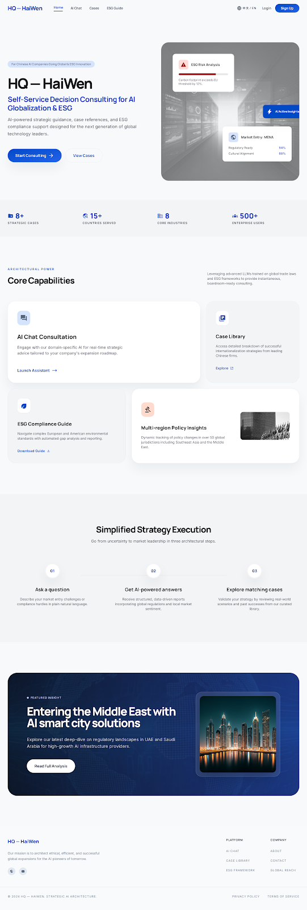
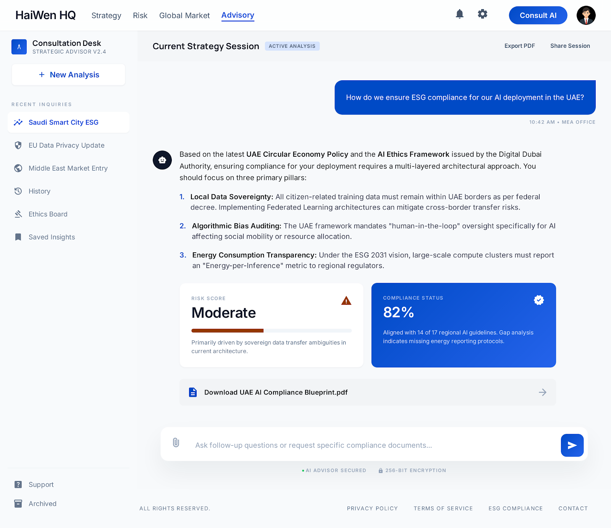
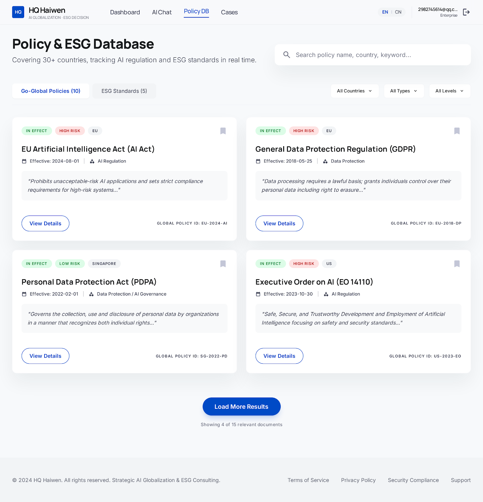
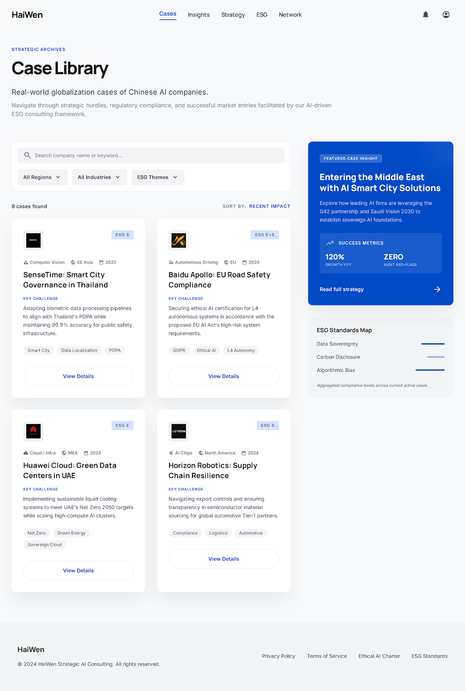
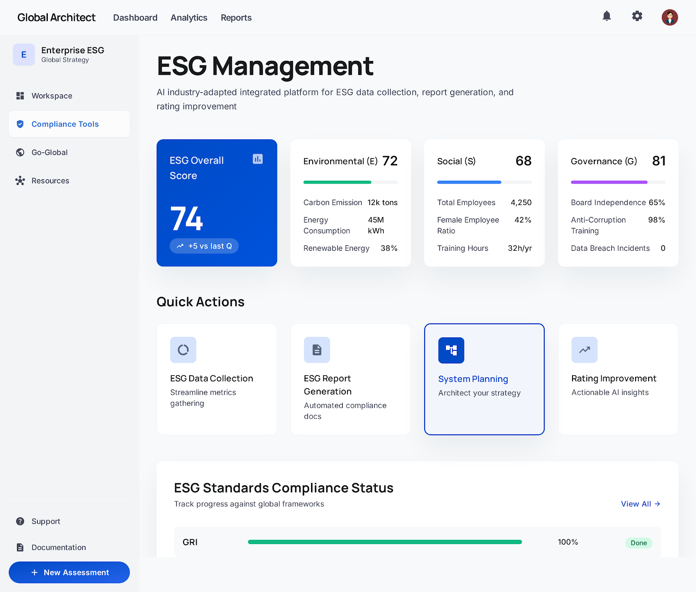
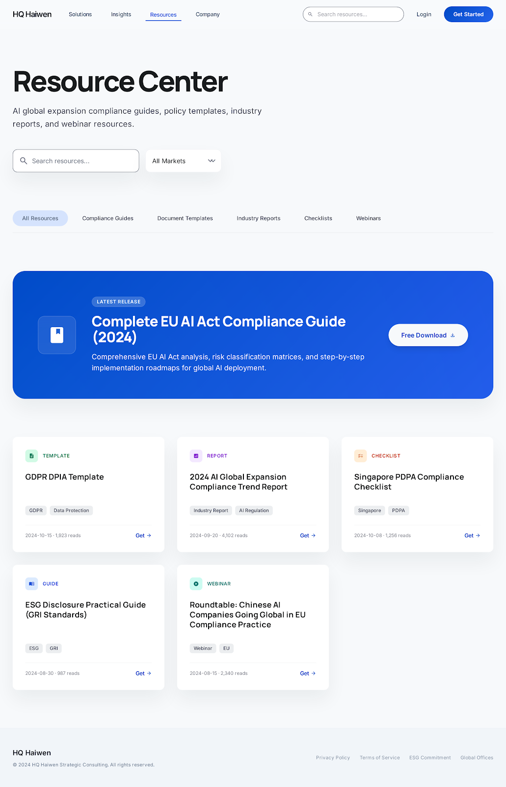

# HQ / Haiwen AI Consulting Platform — UI Design Archive

This repository contains the exported UI design materials for **HQ / Haiwen (海问)**, an AI-powered self-service consultation platform designed for Chinese AI enterprises facing global expansion, ESG compliance, and cross-border business decision-making challenges.

The repository is mainly used as a **UI design evidence archive** for the ENT208TC Industry Readiness project. It documents the current website screenshots, Stitch-generated UI concepts, and iterative design exploration for different parts of the Haiwen platform.

---

## Project Overview

**HQ / Haiwen** aims to provide faster, more affordable, and more accessible consulting support for AI companies that need guidance on:

- AI globalization strategy
- ESG compliance and reporting
- Cross-border market-entry risks
- International policy and regulatory updates
- Practical case references from AI enterprises

Unlike traditional consulting services, the platform is designed as a self-service digital product where users can ask questions, browse policy resources, review industry cases, and access structured compliance support through a web-based interface.

---

## Repository Purpose

This repository is not the final production codebase. Instead, it is used to record the **UI design process** and support the project portfolio, development log, and presentation evidence.

It includes:

- Screenshots of the current implemented website
- Stitch-generated UI design alternatives
- HTML prototypes exported from Stitch
- Static screen previews for each UI concept
- Design-system notes and visual direction references

---

## Important Note on Part Structure

Each platform part may contain **one or two generated UI design versions**, depending on how many alternatives were created during the design iteration process.

In general:

- If a part contains **three visual items**, it usually means:
  - one `image` screenshot showing our current implemented website
  - two generated UI design versions created by Stitch

- If a part contains **two visual items**, it usually means:
  - one `image` screenshot showing our current implemented website
  - one generated UI design version created by Stitch

Therefore, the `image` files are mainly used as references to show the current web implementation, while the generated UI folders show alternative or improved design directions.

---

## Repository Structure

The exported materials are organized into several design batches:

```text
stitch_haiwen_ai_consulting_platform/
├── stitch_haiwen_ai_consulting_platform_p1/
│   ├── hq_haiwen_landing_page/
│   ├── ai_chat_consultation/
│   ├── policy_esg_database/
│   ├── policy_esg_database_mvp/
│   ├── case_library_hq_haiwen/
│   ├── case_library_evolution/
│   ├── compliance_diagnosis_dashboard/
│   ├── compliance_diagnosis_advanced_strategic_view/
│   ├── risk_assessment_dashboard/
│   ├── risk_assessment_advanced_intelligence_dashboard/
│   ├── global_horizon/
│   └── image.png_*/
│
├── stitch_haiwen_ai_consulting_platform_p2/
│   ├── esg_management_dashboard/
│   ├── esg_management_strategic_decision_dashboard/
│   ├── compliance_solution_toolbox/
│   ├── data_analysis_center_hq_haiwen_dashboard/
│   ├── data_analysis_center_advanced_strategic_hub/
│   ├── enterprise_management_center_hq_haiwen/
│   ├── enterprise_management_center_advanced_admin_console/
│   ├── expert_hall_professional_consultation_marketplace/
│   ├── resource_center_hq_haiwen_knowledge_hub/
│   ├── global_horizon/
│   └── image.png_*/
│
└── stitch_haiwen_ai_consulting_platform_p3/
    ├── global_horizon/
    └── image.png_*/
```

Most generated UI folders include:

```text
code.html
screen.png
```

- `code.html` — standalone HTML prototype exported from Stitch
- `screen.png` — static screenshot preview of the generated UI

The `image.png_*` folders usually contain screenshots of our existing website or reference visuals used to compare with the generated UI designs.

---

## Main UI Parts

| UI Part | Purpose |
|---|---|
| Landing Page | Introduces Haiwen as an AI globalization and ESG consultation platform. |
| AI Chat Consultation | Provides a consultation workspace for ESG, compliance, and market-entry questions. |
| Policy & ESG Database | Displays ESG rules, AI governance references, and regulatory resources. |
| Case Library | Presents enterprise cases and practical references for AI globalization and ESG practice. |
| Compliance Diagnosis | Supports compliance self-assessment and diagnosis history review. |
| Risk Assessment | Visualizes policy, ESG, market-entry, and operational risk signals. |
| ESG Management | Shows ESG performance indicators, progress tracking, and governance-related information. |
| Compliance Solution Toolbox | Provides templates, implementation plans, policy monitoring, and IP protection resources. |
| Data Analysis Center | Presents compliance trends, risk changes, and strategic data insights. |
| Enterprise Management Center | Supports enterprise profile, permission, project, document, and message management. |
| Expert Hall | Presents a professional consultation marketplace with verified experts. |
| Resource Center | Collects guides, reports, templates, webinars, and ESG/AI compliance resources. |

---

## Design Direction

The overall visual direction follows a professional consulting and enterprise SaaS style.

The interface design focuses on:

- Clean and high-end layout
- Blue and cool-gray color palette
- Card-based information structure
- Clear dashboard hierarchy
- Professional typography
- ESG and policy intelligence visual elements
- Strategic decision-making atmosphere
- Enterprise-level trust and credibility

The design-system notes are stored in the `global_horizon` folders:

```text
global_horizon/DESIGN.md
```

These files describe the design concept, visual tone, layout principles, typography, color usage, and component logic used across the generated UI versions.

---

## Preview Examples

### Landing Page



### AI Chat Consultation



### Policy & ESG Database



### Case Library



### ESG Management Dashboard



### Resource Center



---

## How to View the Prototypes

No build process is required.

Each generated UI prototype can be opened directly in a browser by opening its `code.html` file.

Example:

```text
stitch_haiwen_ai_consulting_platform/
└── stitch_haiwen_ai_consulting_platform_p1/
    └── hq_haiwen_landing_page/
        └── code.html
```

Recommended viewing methods:

1. Open `code.html` directly in a browser.
2. Use VS Code with the Live Server extension for a cleaner local preview.
3. Open `screen.png` if only a static preview is needed.

> Note: Some exported HTML files may depend on online resources such as Tailwind CSS, Google Fonts, or Material Symbols. An internet connection may be required for the full visual style to load correctly.

---

## Current Status

This repository is a **UI design and prototype archive**, not the final production source code.

It is used to document:

- Current website screenshots
- UI exploration generated through Stitch
- Before-and-after interface comparison
- Multiple UI design directions for the same platform part
- Design evidence for the Development Log
- Supporting materials for Demo Day, portfolio, and technical documentation

The final implemented website may differ from these exported screens due to development constraints, user validation feedback, and technical feasibility.

---

## Use in ENT208TC Portfolio

This repository can support the following ENT208TC evidence:

- UI/UX design process
- Iterative design comparison
- ESG browsing page improvement
- Case library interface development
- Platform feature scope explanation
- Visual evidence for the Development Log
- Design references for Demo Day presentation
- Supporting materials for the Technical Documentation and Validation Report

---

## Team / Module Context

- **Project:** HQ / Haiwen AI Consultation Platform
- **Module:** ENT208TC Industry Readiness
- **Team:** Group 13
- **Project Type:** Web platform / AI & ESG consultation product
- **Main Focus:** User-centered design, iterative validation, and professional product documentation

---

## License

This repository is for academic project documentation and presentation purposes only. Commercial use, redistribution, or reuse of the design assets should be discussed with the project team.
